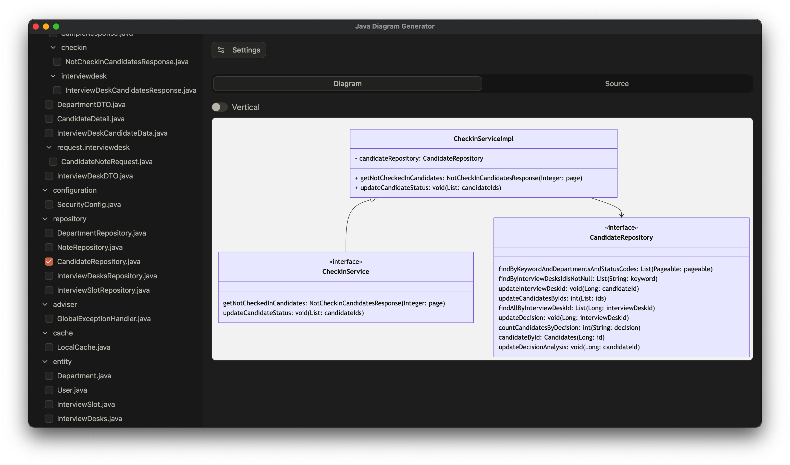

# JDG - Java Diagram Generator



A cross-platform app to generate diagrams from Java source code, built with TypeScript, Rust, and Tauri.

## Features
- Parse Java source code to extract class relationships.
- Generate Mermaid class diagrams.
- Cross-platform support (Windows, macOS, Linux).
- Lightweight and fast, powered by Rust backend.
- User-friendly interface with TypeScript and Tauri.

## Installation
1. Download the latest release from [GitHub Releases](https://github.com/prometheusalpha/JDG/releases).
2. Install the app:
   - **Windows**: Run `java-diagram-generator_x.x.x_x64_en-US.msi`.
   - **macOS**: 
     - **Intel**: Run `java-diagram-generator_x.x.x_x64.dmg`.
     - **Apple Silicon**: Run `java-diagram-generator_x.x.x_aarch64.dmg`.
   - **Linux**: Use `JDG-x.x.x.AppImage` or install via `deb`/`rpm` or use `tar.gz`.
3. Launch JDG.

## Usage
1. Open JDG.
2. Add a Java folder via the "+" button.
3. Select the classes you want to include in the diagram.
4. Preview the diagram in the app.
5. Copy the diagram markdown code to your clipboard. (Copy / Export image feature coming soon)

## Future ideas
- [x] Add copy / export image feature.
- [x] Add support for file search.
- [x] Add support for pan and zoom.
- [x] Add support for Java enum / record
- [ ] Add support for more diagram customization options (e.g., colors, styles).
- [ ] Add support for remote Java projects (e.g., GitHub, GitLab).
- [ ] Add support for more types of diagrams (e.g., sequence).
- [ ] Add support for more Java frameworks (e.g., Spring).
- [ ] Add support for diagrams saving and management.

## Development
### Prerequisites
- Node.js
- Rust 
- Cargo
- Bun
- Tauri CLI (`cargo install tauri-cli`)

### Setup
1. Clone the repo:
   ```bash
   git clone https://github.com/prometheusalpha/JDG.git
   cd jdg
   ```
2. Install frontend dependencies:
   ```bash
   bun install
   ```
3. Build and run:
   ```bash
   cargo tauri dev
   ```

## Building
To build the app for distribution:
```bash
cargo tauri build
```
Output binaries are in `src-tauri/target/release`.

## Contributing
1. Fork the repo.
2. Create a feature branch (`git checkout -b feature-name`).
3. Commit changes (`git commit -m "Add feature"`).
4. Push to the branch (`git push origin feature-name`).
5. Open a pull request.

## License
MIT License. See [LICENSE](LICENSE) for details.

## Contact
- Issues: [GitHub Issues](https://github.com/prometheusalpha/JDG/issues)